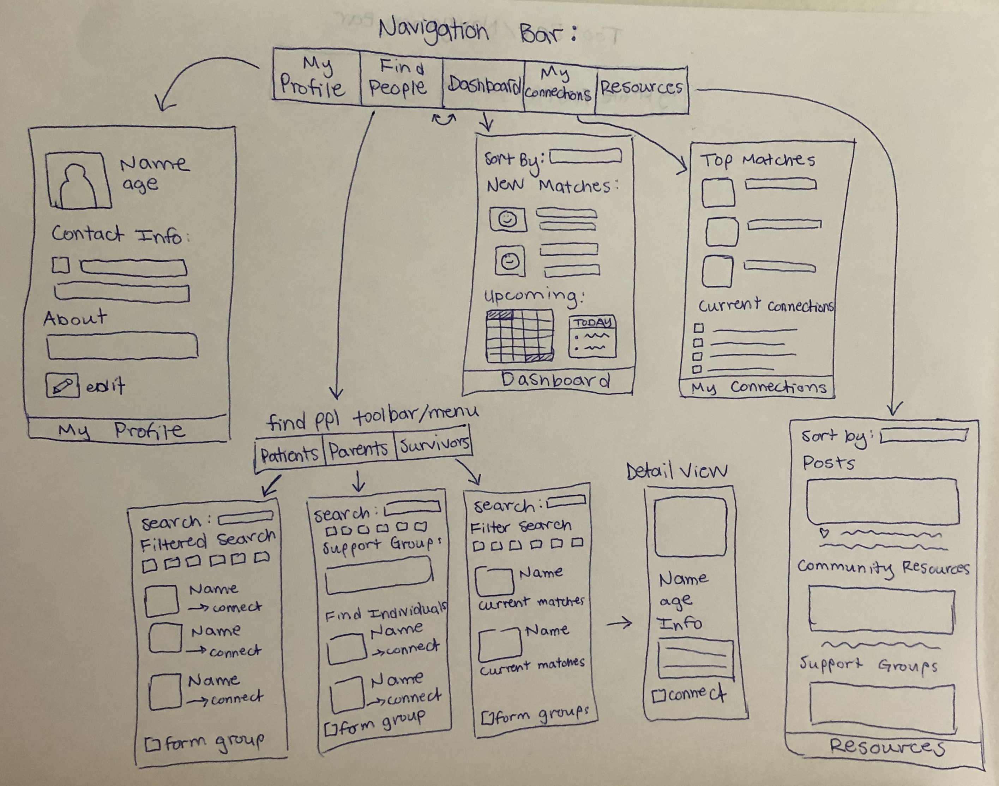

Final Project App Idea
===
by Helen Paulini
# Penpal Match (need to think of name)

## Table of Contents
1. [Overview](#Overview)
1. [Product Spec](#Product-Spec)
1. [Wireframes](#Wireframes)
2. [Schema](#Schema)

## Overview
### Description
This app is for patients at Children's Hospitals, and people who have gone through similar experiences who will be paired with the patients to be their penpals. In particular, I want to start by focusing on pediatric oncology, and matching current pediatric cancer patients with childhood cancer survivors. This app can also be used by parents of patients, as a resource and to communicate with other parents or survivors.

### App Evaluation

- **Category:** Networking, Matching
- **Mobile:** This will be a mobile app, as it is meant for patients and former patients to connect and share resources together, and utilize mobile communication/interaction.
- **Story:** Being able to connect with someone who has gone through a similar experience as you is very valuable, especially when it comes to something like having cancer, or other medical experiences with lots of unkowns.
- **Market:** This app can be used by any patient at a childrens hospital, parent of a patient, or someone who wants to interact as a penpal partner.
- **Habit:** This app can be used at any point of a patient's cancer journey, and is meant to be a helpful resource to make the process a little less daunting to navigate.
- **Scope:** V1 could be focused on matching current cancer patients with cancer survivors, and exchanging contact information between matches. V2 would allow for in-app messaging and communication between matches. V3 would include matching between more people than just current and former patients, for example, parents, siblings, and family members.

## Product Spec

### 1. User Stories (Required and Optional)

**Required Must-have Stories**

* User can log in using their email, and create a profile (and can edit profile anytime)
* User can specify if they are a current cancer patient or cancer survivor
* User can specify things about their experiences, such as the type of cancer they had/have, and the hospital they went to
* Users are matched based on their experiences/info
* User can view other other people on the app, this can be a filtered view
* Matches can communicate with one another, whether it be through an exchange of contact info

**Optional Nice-to-have Stories**

* Users can input helpful information and other resources
* Users can view information and resources submitted by others
* Hospital information is supplemented by Google maps API/info, location, etc
* Users can match with other users to form groups (expanding past 1:1 matching)
* Users can internally message each other within the app
* A resources page/feed, listing different types of cancer and other relevant information

### 2. Screen Archetypes

* Login
   * User logs in with their email address and password of their choice
* User Profile
   * User can upload a photo
   * User insert their name, age, hospital, type of cancer, intersts, other info
* Dashboard
   * User sees the most latest list of users and their top matches
* View other Users
   * View users by categories
   * Has a filtered search
   * Can tap on a user to view more information on them or "ping" them
* Upload Information
   * Users can post helpful information
* "My Connections" Page
   * Some sort of page to keep track of the people you are matched with or interacting with/penpals with

### 3. Navigation

**Tab Navigation** (Tab to Screen)

* My Profile
* Find Matches
    * Current
    * Former
* Upload Resources
* My Connections

**Flow Navigation** (Screen to Screen)

* Login -> Dashboard
* Find Matches -> View user details
* View user details -> connect/match with user
* Upload resources -> page to insert posts

## Wireframes


### Digital Wireframes & Mockups

### Interactive Prototype

## Schema 
### Models
#### User in the "find matches" view

   | Property      | Type     | Description |
   | ------------- | -------- | ------------|
   | userId      | String   | unique id for the user (their email address) (default field) |
   | name        | Pointer to User| the user's name |
   | profilePic         | File     | user's profile picture |
   | userInfo       | String   | image caption by author |
   | userStatus       | String   | indicates if this user is a current cancer patient or a cancer survivor |
   | age | Number   | user's age |
   | dateJoined     | DateTime | date when the user joined the app (default field) |
   | matchStatus       | Boolean   | indicates if this user is someone who you have matched with |

#### Post in the resources tab

   | Property      | Type     | Description |
   | ------------- | -------- | ------------|
   | postId      | String   | unique id for the user post (default field) |
   | author        | Pointer to User| image author |
   | image         | File     | image that user posts (optional) |
   | caption       | String   | image caption by author |
   | commentsCount | Number   | number of comments that has been posted to an image |
   | createdAt     | DateTime | date when post is created (default field) |
   | updatedAt     | DateTime | date when post is last updated (default field) |
### Networking
#### List of network requests by screen
   - Resources feed screen
      - (Read/GET) Query all posts filtered by a search category or search word
         ```swift
         let query = PFQuery(className:"Post")
         query.whereKey(posts.getCaption.contains("searchword"))
         query.order(byDescending: "createdAt")
         query.findObjectsInBackground { (posts: [PFObject]?, error: Error?) in
            if let error = error { 
               print(error.localizedDescription)
            } else if let posts = posts {
               print("Successfully retrieved \(posts.count) posts.")
           // Display relevant posts...
            }
         }
         ```
      - (Create/POST) Create a new comment on a post
      - (Delete) Delete existing comment
   - Create Post Screen
      - (Create/POST) Create a new post object
   - Profile Screen
      - (Read/GET) Query logged in user object
      - (Update/PUT) Update user profile image or information
### Networking
- [Add list of network requests by screen ]
- [Create basic snippets for each Parse network request]
- [OPTIONAL: List endpoints if using existing API such as Yelp]
